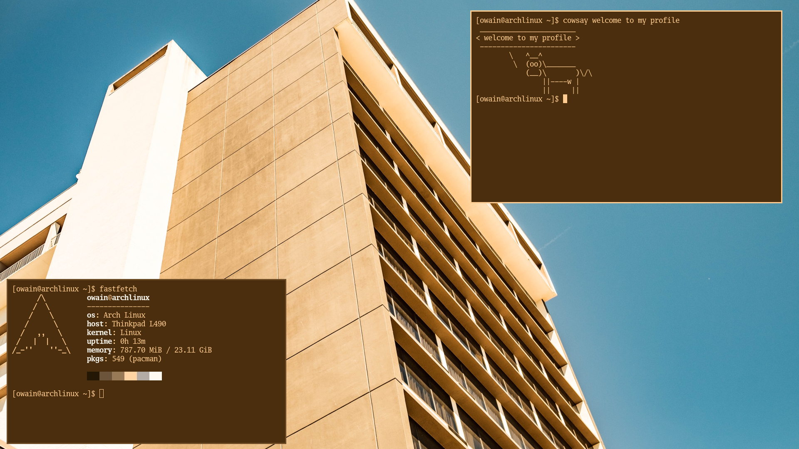

  

### about

Python/Nix builder. NixOS daily driver.

🌐 [github.com/epwv](https://github.com/epwv)

🌐 [huhfloppuh.com](https://huhfloppuh.com)

🌐 [epwv.github.io](https://epwv.github.io/infopage/)

---

### core skills

  
  
  

| Category | Skills |
| --- | --- |
| Languages | Nix • Python • Shell |
| OS | NixOS |

---

### featured projects

#### [lian-li-linux-nix](https://github.com/epwv/lian-li-linux-nix)
**Lian Li RGB/Fan Control for NixOS**

Nix packaging for Lian Li hardware control on Linux.

 

#### [gh-name-check](https://github.com/epwv/gh-name-check)
**GitHub Username Availability Checker**

Python tool for checking short/available GitHub usernames.

 

#### [fastfetch-config](https://github.com/epwv/fastfetch-config)
**Fastfetch Config**

NixOS configuration and a custom fastfetch theme.

---

